# Agent Isolation Workflow

This document is the canonical reference for the run-time slot/session isolation model.
It complements the architecture doc by showing how visible slot identities, warm live
sessions, bounded debate, and coordinator-owned procedural merges fit together.

## Workflow

```mermaid
flowchart LR
    C["Coordinator"] --> H1["Hunter 1 session"]
    C --> H2["Hunter 2 session"]
    H1 --> HA1["Hunter 1 artifact"]
    H2 --> HA2["Hunter 2 artifact"]
    HA1 --> D["Coordinator dedupe/merge"]
    HA2 --> D
    D --> P["Issue packets"]

    P --> S1["Skeptic 1 session"]
    P --> S2["Skeptic 2 session"]
    S1 --> SV1["Skeptic 1 verdict"]
    S2 --> SV2["Skeptic 2 verdict"]

    SV1 --> SX{"Disagree?"}
    SV2 --> SX
    SX -->|yes| SD["Limited skeptic thread"]
    SD --> SM["Coordinator skeptic merge"]
    SX -->|no| SM

    SM --> RP["Referee packets"]
    RP --> R1["Referee 1 session"]
    RP --> R2["Referee 2 session"]
    R1 --> RV1["Referee 1 verdict"]
    R2 --> RV2["Referee 2 verdict"]

    RV1 --> RX{"Disagree?"}
    RV2 --> RX
    RX -->|yes| RD["Limited referee thread"]
    RD --> RM["Coordinator referee merge"]
    RX -->|no| RM

    RM --> T["Human truth review"]
    T --> SO["Confirmed bug packets"]
    SO --> SL1["Solver 1 worktree/session"]
    SO --> SL2["Solver 2 worktree/session"]
    SL1 --> V["Shared baseline validation"]
    SL2 --> V
    V --> FC["Coordinator solver comparison summary"]
```

## Rules Of The Road

- Each run exposes one visible slot identity for each configured role family slot.
- Each slot has at most one live session at a time.
- Sessions stay warm by default in v1.
- If context becomes bloated, the coordinator may compact and rehydrate the same slot identity.
- Rehydration must be grounded in checkpoint artifacts and referenced prior artifacts, not hidden coordinator paraphrase alone.
- Hunters do not chat with each other.
- Solvers do not debate each other.
- Cross-family chat is not allowed.
- Direct limited debate is allowed only for skeptic-to-skeptic and referee-to-referee disagreements.
- Debate is opened only after the coordinator detects disagreement on one issue packet.
- Each debate thread is bounded to one issue packet, a fixed evidence bundle, and a maximum of two turns per side.
- Each side may read the opposing artifact and the current live rebuttal history for that debate thread.
- Debate transcripts are append-only artifacts.
- The coordinator closes debate threads and performs procedural merges, but it does not make substantive code-truth or fix-quality judgments on its own.
- If a disagreement remains unresolved after the allowed turns, both positions must be forwarded cleanly and minimally.

## Isolation Contract

- Hunters read the target snapshot, threat model, shared resources, and their own slot resources, then write only their own findings.
- Skeptics read the coordinator-built issue packets and write only their own verdicts plus bounded debate turns when a disagreement thread exists.
- Referees read issue packets, skeptic outputs, and debate transcripts when present, then write only their own verdicts plus bounded rebuttal turns when needed.
- Solvers read only confirmed bug packets plus merged referee context and write only in their own worktree and artifact areas.
- The coordinator owns stage transitions, artifact validation, dedupe, merge mechanics, and persistence.

## Future Note

Warm sessions are the locked default for now. A more ephemeral execution option may still
be worth adding later for selected stages or debugging workflows, but that is not part of
the current v1 design.
