# Agent Isolation Workflow

This document is the canonical reference for the run-time slot/session isolation model.
It complements the architecture doc by showing how visible slot identities, warm live
sessions, bounded debate, and coordinator-owned traceable assembly fit together.

## Workflow

```mermaid
flowchart LR
    C["Coordinator"] --> H1["Hunter 1 session"]
    C --> H2["Hunter 2 session"]
    H1 --> HA1["Hunter 1 artifact"]
    H2 --> HA2["Hunter 2 artifact"]
    HA1 --> D["Coordinator cluster-first assembly"]
    HA2 --> D
    D --> P["Issue packets"]

    P --> S1["Skeptic 1 session"]
    P --> S2["Skeptic 2 session"]
    S1 --> SV1["Skeptic 1 verdict"]
    S2 --> SV2["Skeptic 2 verdict"]

    SV1 --> SX{"Disagree?"}
    SV2 --> SX
    SX -->|yes| SD["Limited skeptic thread"]
    SD --> SM["Coordinator skeptic summary"]
    SX -->|no| SM

    SM --> RP["Referee packets"]
    RP --> R1["Referee 1 session"]
    RP --> R2["Referee 2 session"]
    R1 --> RV1["Referee 1 verdict"]
    R2 --> RV2["Referee 2 verdict"]

    RV1 --> RX{"Disagree?"}
    RV2 --> RX
    RX -->|yes| RD["Limited referee thread"]
    RD --> RM["Coordinator referee report assembly"]
    RX -->|no| RM

    RM --> T["Human truth review"]
    T --> SO["Confirmed bug packets"]
    SO --> SL1["Solver 1 worktree/session"]
    SO --> SL2["Solver 2 worktree/session"]
    SL1 --> V["Shared baseline validation"]
    SL2 --> V
    V --> FC["Coordinator solver comparison summary"]
```

## Rules Of The Road

- Each run exposes one visible slot identity for each configured role family slot.
- Each run creates one initial reserved session epoch marker for each slot identity, but slot workers start only when the coordinator dispatches work to that slot.
- Each slot has at most one live session at a time.
- Sessions stay warm by default in v1 and should remain live as long as possible.
- Each live slot session is awdit-owned, heartbeat-tracked, and may have one attached provider handle. The provider handle is warm state, not the slot identity.
- Each slot may have one active dispatch and one pending dispatch only.
- An epoch that has never received a dispatch is not live yet, has no lease or heartbeat, and cannot be compacted or rehydrated.
- If context becomes bloated or the attached provider handle fails, the coordinator may compact and rehydrate the same slot identity into a new session epoch.
- Rehydration must be checkpoint-driven, slot-preserving, and grounded in evidence-addressed checkpoint artifacts plus referenced prior artifacts, not hidden coordinator paraphrase alone.
- Slot checkpoints are authored by the slot and validated by the coordinator.
- Worker heartbeats are the canonical liveness signal for a live slot session. Provider activity is secondary metadata only.
- A completed dispatch writes a fresh checkpoint. Compaction and failure recovery also write checkpoint or recovery artifacts before the next epoch starts.
- 75% context usage triggers an advisory CLI warning. 90% context usage forces compaction at the next safe boundary.
- Normal compaction happens only at safe boundaries between dispatches. Mid-dispatch compaction is reserved for hard failure recovery.
- Hunters do not chat with each other.
- Solvers do not debate each other.
- Cross-family chat is not allowed.
- Direct limited debate is allowed only for skeptic-to-skeptic and referee-to-referee disagreements.
- Prompts, models, review targets, and operator-selected startup resources are fixed for the run. If any of those need to change, the run should end and a new run should start.
- Debate is opened only after the coordinator detects disagreement on one issue packet revision.
- Each debate thread is bounded to one issue packet revision, separate side-prepared strongest bundles for that revision, and a maximum of two turns per side.
- Each side may read the opposing artifact and the current live rebuttal history for that debate thread.
- If substantive new evidence appears after debate opens, the coordinator creates a new packet revision and dispatches that revision explicitly rather than mutating the live debate.
- Packet revisions and other new work arrive as fresh dispatches to the same slot identity. They are never silent mutations of the existing live session context.
- Unrelated work may not replace a pending dispatch. Same-packet supersession may replace the pending dispatch slot, but the exact coordinator judgment and operator-approval policy remains `TBD`.
- Debate transcripts are append-only artifacts.
- The coordinator closes debate threads and performs traceable assembly with citations, but it does not make substantive code-truth or fix-quality judgments on its own.
- If a disagreement remains unresolved after the allowed turns, both positions must be forwarded cleanly and minimally.

## Isolation Contract

- Hunters read the target snapshot, threat model, shared resources, and their own slot resources, then write only their own findings.
- Skeptics read the coordinator-assembled issue packets and write only their own verdicts plus bounded debate turns when a disagreement thread exists.
- Referees read issue packets, skeptic outputs, and debate transcripts when present, then write only their own verdicts plus bounded rebuttal turns when needed.
- Solvers read only confirmed bug packets plus merged referee context and write only in their own worktree and artifact areas.
- The coordinator owns stage transitions, artifact validation, cluster-first assembly, merge mechanics, packet revisioning, and persistence.

## Open Contract Areas

- The exact `dispatch envelope` schema remains `TBD`.
- The exact `slot checkpoint` schema remains `TBD`.
- The exact `issue packet revision` schema and revision acknowledgment contract remain `TBD`.
- The exact coordinator policy for replacing an already-pending dispatch during same-packet supersession remains `TBD`.
- The exact downstream referee handling for unresolved skeptic disagreement remains `TBD`.

## Future Note

Warm sessions are the locked default for now. A more ephemeral execution option may still
be worth adding later for selected stages or debugging workflows, but that is not part of
the current v1 design. Exact CLI polish for compaction prompting may still evolve after
production testing, but the runtime contract above is the intended production model.
