# awdit Architecture

## Status
Working architecture draft. This document records the design decisions that are currently locked and leaves intentionally open areas marked as `TBD`.

## Summary
- Build a Python-based interactive CLI that automates an AI security audit workflow.
- Start OpenAI-first, but keep a provider abstraction so additional providers such as OpenRouter can be added later.
- Keep the repository simple, readable, and well-documented, with clear artifacts and logs for every run.
- Start docs-first: this repo currently captures the system design and operator experience before implementation begins.

## Workflow

```mermaid
flowchart LR
    A["User selects target, models, and optional external resources"] --> H1["Hunter 1"]
    A --> H2["Hunter 2"]

    H1 --> L["Shared Hunter Issue Ledger<br/>deduped by cited code-line overlap"]
    H2 --> L

    L --> S1["Skeptic 1"]
    L --> S2["Skeptic 2"]

    S1 --> P["Structured Issue Packets"]
    S2 --> P

    P --> R1["Referee 1"]
    P --> R2["Referee 2"]

    R1 --> D["Disagreement Rebuttal Round<br/>only for referee conflicts"]
    R2 --> D

    D --> M["Merged Referee Report"]

    M --> F["Auto-dismissed issues recorded in final report<br/>not sent to human review"]
    M --> T["Human Truth Review<br/>only unresolved / recommended-real issues"]

    T --> C["Confirmed Bug List"]
    C --> V1["Solver 1"]
    C --> V2["Solver 2"]

    V1 --> W["Per-bug solver comparison<br/>human chooses solution"]
    V2 --> W

    W --> I["Integration branch + final amended report"]
```

## Product Summary
The CLI must support:
- whole local repository
- diff against `main`
- single commit
- explicit file list
- GitHub PR
- pasted diff or text

Local git refs are the default path when both local and GitHub inputs are possible.

## Core UX
- Primary UX is an interactive CLI wizard.
- The CLI guides the user through target selection, scope rules, model selection, optional external resource attachment, human truth review, and per-bug solver selection.
- Model selection is driven by config, and the user chooses by number rather than typing model IDs.
- The CLI should surface artifact paths as it goes, including issue reports and solver reports.
- The CLI should expose a separate wizard-style `scoreboard` command backed by the local database.
- A new run ID is created for every attempt. v1 does not support resuming interrupted runs.

## Scope Rules And Context Gathering
- Include globs define which tracked files are eligible for direct inspection and surrounding context.
- Exclude globs remove matching files from audit scope, even if they would otherwise be included.
- Whole-repo review supports tracked files with include/exclude globs.
- Context gathering should be broad and budget-aware, pulling in nearby code, helpers, configs, tests, schemas, migrations, and relevant docs up to configured limits.
- Exact budgeting policy remains `TBD`.

## Multi-Agent Architecture

### Agent Slots
There are 8 fixed agent slots:
- Hunter 1
- Hunter 2
- Skeptic 1
- Skeptic 2
- Referee 1
- Referee 2
- Solver 1
- Solver 2

Custom names will be added later. Slot labels are the public-facing default for now.

### Model Selection
- Each agent slot can use a different model.
- Allowed models come from config.
- The CLI displays the configured options numerically and lets the user choose by number.
- Provider-backed live model discovery is deferred for now.

### External Resources
- Before launching the hunters, the CLI asks whether the user wants to attach local file paths or Markdown resources to any agent slot.
- Attached resources are validated, persisted in the run artifacts, and included in the relevant agent context.

## Audit Pipeline

### Hunters
- Hunters compete independently on the same target.
- Every finding must cite exact file paths and code line references.
- Hunters write raw Markdown and structured JSON artifacts.
- Hunters do not take penalties for false positives.
- If both hunters find the same issue, they receive the same reward or no-penalty outcome for that issue.

### Shared Hunter Issue Ledger
- Hunter output is normalized into a shared candidate ledger with stable finding IDs.
- Dedupe is driven by hunter-cited code lines.
- If more than two-thirds of cited code lines overlap for the same issue, treat the findings as the same issue and merge them.
- If issues overlap but the overlap is less than two-thirds, keep them separate and tag them as partial overlaps for downstream review.
- Provenance must record which hunters originated each issue.

### Skeptics
- Skeptics compete independently on the shared hunter issue ledger.
- Skeptics can challenge or accept existing issues, but they cannot introduce new issues.
- Skeptic outputs must include their decision, reasoning, confidence, and cited lines when relevant.
- If both skeptics reach the same effective conclusion on an issue, they receive the same reward or penalty outcome later.

### Structured Issue-Packet Handoff
Each issue packet handed from the skeptic stage to the referee stage should contain:
- stable finding ID
- file paths and exact cited code lines
- merged vs partial-overlap status
- hunter provenance
- hunter claim summaries
- skeptic decisions, confidence, reasoning, and cited lines
- unresolved questions
- links to the issue Markdown file and linked code references

### Referees
- Referees compete independently first on the full set of structured issue packets.
- Each referee decides which issues are real bugs vs not bugs and writes a full raw report.
- If both referees reach the same effective conclusion on an issue, they receive the same reward or penalty outcome later.
- Referee scoring remains provisional and will be refined later.

### Referee Merge And Rebuttal
- After the independent referee pass, the system compares the referee outcomes.
- Agreements are merged directly.
- Disagreements trigger one short rebuttal round for the disputed issues only.
- After rebuttals, the coordinator emits one merged referee report.
- The merged report is the only referee report sent forward to the human truth-review step.
- Raw referee reports and rebuttal artifacts are still stored for transparency.

### Auto-Dismissed Issues
- If both skeptics say `NOT A BUG` and the merged referee outcome is also `NOT A BUG`, that issue is not sent to the human truth-review step.
- The issue still appears in the final merged referee report and run artifacts for transparency and debugging.

### Human Truth Review
- The human reviews the merged referee report issue by issue.
- Choices are `yes`, `no`, or `unsure`.
- Each issue shown to the human should include a link to its issue Markdown file and linked code references.
- `Unsure` issues are documented separately.
- The CLI can continue to the solver stage with the confirmed subset if the user approves.

## Solver Pipeline
- Solvers work only from the single merged referee report and only on the confirmed bug list.
- Each solver gets its own git worktree.
- Each solver should keep code simple, favor reusable helpers and established patterns, and add comments only when helpful.
- Each solver should produce one commit per confirmed bug.
- Each solver writes Markdown and JSON artifacts, including per-bug solution reports with links to the changed code.
- Validation runs only after a solver finishes its full patch set, not after each per-bug commit.
- Validation commands come from config.
- Solver mistake and disqualification details remain provisional and will be finalized later.

## Final Selection And Output
- Referees score solver outputs after both solvers finish and validations have run.
- The CLI shows both solver options per confirmed bug, including scores, solution-report paths, and code links.
- The human selects Solver 1 or Solver 2 per bug.
- The system creates an integration branch or worktree with the chosen per-bug commits applied in finding-ID order.
- The final amended report includes:
  - confirmed bugs
  - auto-dismissed and unsure issues
  - links to old bad code
  - links to chosen fixed code
  - score summaries
  - selected solver per bug

## Persistence And Artifacts
- Store persistent state in SQLite.
- Keep a scoreboard in the database so the user can query accumulated results later.
- Persist run metadata, agent runs, findings, solver decisions, artifact paths, prompt snapshots, and logs.
- Always document runs thoroughly for debugging, including partial or failed runs.
- Expected artifact areas include:
  - run metadata
  - prompt snapshots
  - raw agent reports
  - issue Markdown files
  - merged referee report
  - truth-labeled summary
  - solver comparison summary
  - validation logs

Detailed schema remains `TBD`.

## GitHub And Local Code References
- Support both local git references and GitHub PR-based reviews.
- Prefer local refs by default and use GitHub PR mode when the user explicitly selects it.
- Issue and solver Markdown files should link back to the underlying code.
- Final reports should use local file-and-line references when running locally and GitHub links when that context is available.

## Prompt Strategy
- Prompts remain flexible and editable for now.
- Existing prompts are strong starting material, but prompt wording is not frozen.
- The referee stage should remain compatible with a human truth-review source of truth.

## Scoring
- Scoring is intentionally provisional at this stage.
- Hunters are recall-first and take no penalty for false positives.
- Shared conclusions should share outcomes:
  - if both hunters find the same issue, they get the same reward or no-penalty outcome
  - if both skeptics reach the same conclusion, they get the same reward or penalty outcome
  - if both referees reach the same conclusion, they get the same reward or penalty outcome
- Exact formulas will be refined later.

## Future Exploration
- Experiment with richer retrieval, iteration, and research loops later.
- A future direction is to try Karpathy-style `autoresearch` ideas to improve the system's ability to gather context, test hypotheses, and refine its own investigative paths.

## Open Areas
The following are intentionally still open:
- exact config schema
- exact SQLite schema
- exact score formulas
- exact provider interface details
- exact validation/disqualification policy
- exact artifact naming conventions
- exact worktree cleanup policy
