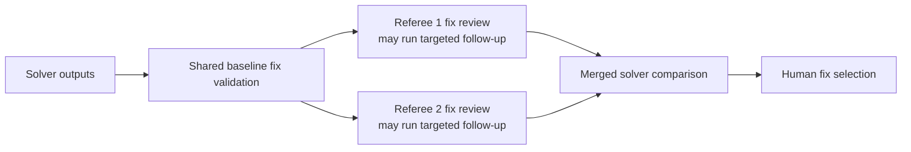
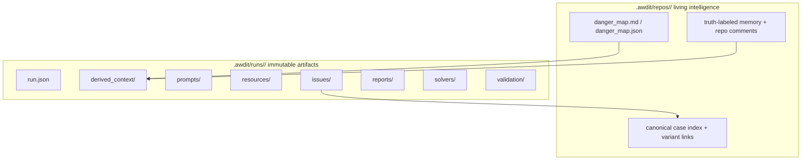

# awdit Architecture

## Status
Working architecture draft. This document records the design decisions that are currently locked and leaves intentionally open areas marked as `TBD`.

## Summary
- Build a Python-based interactive CLI for AI-assisted security review and repair.
- Keep two top-level review shapes: `feature review` and `full repo review`.
- Preserve the core hunter, skeptic, referee, and solver role families.
- Keep prompt files editable and configurable; exact slot wording remains intentionally `TBD`.
- Maintain a strict split between immutable run artifacts and evolving repo-scoped security memory.
- Keep bug-truth validation inside the referee stage and fix-quality validation after solvers finish.

## End-To-End Workflow

```mermaid
flowchart LR
    A["Repo detected"] --> B["Danger map bootstrap or refresh"]
    B --> C{"Review shape"}
    C -->|Feature review| D["Target selection<br/>diff / commit / files / PR / pasted text"]
    C -->|Full repo review| E["Whole repo target"]

    D --> F["Scope rules + model lineup + derived role digests"]
    E --> F

    F --> H1["Hunter 1"]
    F --> H2["Hunter 2"]

    H1 --> L["Shared candidate ledger + run-local case files"]
    H2 --> L

    L --> S1["Skeptic 1"]
    L --> S2["Skeptic 2"]

    S1 --> P["Prioritized issue packets"]
    S2 --> P

    P --> R1["Referee 1<br/>tool-using bug-truth judgment"]
    P --> R2["Referee 2<br/>tool-using bug-truth judgment"]

    R1 --> M["Merged referee report"]
    R2 --> M

    M --> T["Human truth review"]
    T --> C2["Confirmed bug list"]

    C2 --> V1["Solver 1"]
    C2 --> V2["Solver 2"]

    V1 --> BV["Shared baseline fix validation"]
    V2 --> BV

    BV --> FR1["Referee 1 fix review<br/>optional targeted follow-up"]
    BV --> FR2["Referee 2 fix review<br/>optional targeted follow-up"]

    FR1 --> W["Merged solver comparison"]
    FR2 --> W

    W --> U["Human fix selection"]
    U --> I["Integration + repo memory update"]
```

## Review Shapes

### Top-Level Choices
- `Feature review`
- `Full repo review`

### Feature Review Inputs
`Feature review` supports:
- diff against `main`
- single commit
- explicit file list
- GitHub PR
- pasted diff or text

Local git refs are the default path when both local and GitHub inputs are possible.

## Core UX
- Primary UX is an interactive CLI wizard.
- The CLI should stay calm and clear even though the internal agents are competitive and high-activity.
- The CLI should surface artifact paths as it goes, including repo-memory files, issue reports, validation artifacts, and solver reports.
- A new run ID is created for every attempt. v1 does not support resuming interrupted runs.
- A separate `scoreboard` command should remain available and backed by local persistent state.

## Danger Map And Repo Memory

### Repo-Scoped Memory
Every repository has one evolving repo-scoped security area under:
- `.awdit/repos/<repo_key>/`

This area stores:
- danger map artifacts
- truth-labeled security memory
- user comments and corrections
- canonical case linking across runs

### Danger Map Lifecycle
- On the first review for a repo, awdit automatically generates the danger map before review begins.
- The user is shown where the danger map lives and must choose one of:
  - accept it and continue
  - provide corrections or guidance, then regenerate it
  - regenerate it without extra guidance
- On later runs, awdit shows the last updated run/time and asks permission before refreshing the danger map at startup.
- The user may attach comments or corrections at startup.
- awdit also performs an automatic end-of-run update using the new run’s truth labels and chosen fixes.

### Derived Role Digests
- Hunters, skeptics, and referees do not read raw long-term memory directly.
- awdit derives compact run-local role digests from repo-scoped memory and the chosen target.
- These digests are persisted in the run folder for transparency, but they are not the long-term source of truth.

## Scope Rules And Context Gathering
- Include globs define which tracked files are eligible for direct inspection and surrounding context.
- Exclude globs remove matching files from audit scope, even if they would otherwise be included.
- `Full repo review` supports tracked files with include/exclude globs.
- Context gathering should be broad and budget-aware, pulling in nearby code, helpers, configs, tests, schemas, migrations, and relevant docs up to configured limits.
- Exact budgeting policy remains `TBD`.

## Multi-Agent Architecture

### Agent Slots
There are 8 fixed agent slots:
- Hunter 1
- Hunter 2
- Skeptic 1
- Skeptic 2
- Referee 1
- Referee 2
- Solver 1
- Solver 2

Custom names may be added later. Slot labels are the public-facing default for now.

### Model Selection
- Each agent slot can use a different model.
- Allowed models come from config.
- The CLI first shows the default per-slot lineup from config and asks for one-step approval.
- If the lineup is rejected, the CLI falls back to slot-by-slot numeric selection.
- Provider-backed live model discovery is deferred for now.

### Prompt Strategy
- Prompt files are configurable and editable.
- Repo-specific prompt overrides should live under `config/repo_prompts/`.
- The exact wording of slot prompts remains intentionally flexible and `TBD`.
- Role behavior is more stable than prompt prose.
- `referee_1` and `referee_2` share the same canonical base behavior by default, while remaining easy to override.

### External Resources
- Shared and slot-specific external resources should be attachable either:
  - entirely through config, or
  - interactively at runtime through the CLI
- Durable local resource defaults should live under:
  - `config/resources/shared/`
  - `config/resources/slots/<slot_name>/`
- By default, awdit includes all discovered files under those folders.
- In the common case, `config.toml` only needs exclude controls:
  - `[resources.shared] exclude = []`
  - `[resources.slots.<slot_name>] exclude = []`
- `include` remains an optional escape hatch for explicit URLs or out-of-tree paths when those should be attached by default.
- Folder discovery is the obvious local-file path and the primary happy path.
- `exclude` hides matching files from the discovered shared or slot folder without deleting them.
- Before launching hunters, awdit computes the effective resource list for the run from the config folders plus configured include/exclude rules.
- The CLI first shows the effective shared resource list for the run and offers:
  - `y` to use the list as shown
  - `e` to replace the exact list for the current run
  - `n` to exit the review wizard before launch
- The CLI should say explicitly that everything under the resource folders is included by default unless excluded in repo config.
- The CLI can then show effective slot-specific resource lists for any selected slot using the same `y / e / n` flow.
- Supported attachment inputs should include:
  - local files
  - local folders
  - Markdown notes
  - code files or whole repo folders
  - explicit web URLs
- The final chosen shared and slot-specific resources for a run should be persisted only under the run-scoped area.
- Repo-scoped memory should not store external resource selections.
- The exact staging mechanism for local copies vs referenced paths vs fetched URL snapshots remains `TBD`, but every attachment must be recorded in a human-reviewable Markdown manifest.
- The current v1 implementation stages local files and folders into the run folder and records URLs in manifests without fetching them.
- The exact persisted per-resource metadata remains `TBD`, but the config surface should stay simple and skimmable.
- Resource attachment prompts should explain to the user that they can keep files wherever convenient locally and point awdit at them during the run.

## Audit Pipeline

### Hunters
- Hunters compete independently on the same target.
- Hunters are recall-first and may overgenerate candidate bugs aggressively.
- Every finding must cite exact file paths and code line references.
- Hunters write raw Markdown and structured JSON artifacts.

### Shared Candidate Ledger
- Hunter output is normalized into a shared candidate ledger with stable finding IDs.
- Dedupe is driven by hunter-cited code lines.
- If more than two-thirds of cited code lines overlap for the same issue, treat the findings as the same issue and merge them.
- If issues overlap but the overlap is less than two-thirds, keep them separate and tag them as partial overlaps.
- Provenance must record which hunters originated each issue.
- Each run writes one run-local case file per finding under `.awdit/runs/<run_id>/issues/`.

### Skeptics
- Skeptics compete independently on the shared hunter issue ledger.
- Skeptics can challenge or accept existing issues, but they cannot introduce new issues.
- Skeptic outputs must include their decision, reasoning, confidence, and cited lines when relevant.
- The coordinator uses skeptic outcomes to prioritize packets for referee attention.

### Issue Packets
Each issue packet handed to referees should contain:
- stable finding ID
- file paths and exact cited code lines
- merged vs partial-overlap status
- hunter provenance
- hunter claim summaries
- skeptic decisions, confidence, reasoning, and cited lines
- exploit or attack-path summary
- strongest counter-argument
- unresolved questions
- links to the run-local case file and linked code references
- links to human-reviewable stage artifacts when they exist

### Referees
- Referees are the final arbiters of `REAL BUG / NOT A BUG`.
- Referees compete independently first on the full set of issue packets.
- Referees are tool-using investigators, not reasoning-only packet readers.
- Referees may gather deeper context and attach validation notes before issuing verdicts.
- Referees write full raw reports and validation notes as artifacts.
- There is no separate pre-solver validator role.

### Referee Merge And Rebuttal
- After the independent referee pass, awdit compares referee outcomes.
- Agreements are merged directly.
- Disagreements trigger one short rebuttal round for disputed issues only.
- After rebuttals, the coordinator emits one merged referee report.
- The merged report is the only referee report sent forward to human truth review.
- Raw referee reports and rebuttal artifacts are still stored for transparency.

### Auto-Dismissed Issues
- If both skeptics challenge an issue successfully and the merged referee outcome is also `NOT A BUG`, that issue is not sent to human truth review.
- The issue still appears in the final merged referee report and run artifacts for transparency and debugging.

### Human Truth Review
- The human reviews the merged referee report issue by issue.
- Choices are `yes`, `no`, or `unsure`.
- Each issue shown to the human should include a link to its run-local case file and linked code references.
- `Unsure` issues are documented separately.
- Only confirmed bugs continue to the solver stage.

## Solver And Fix Comparison Pipeline

### Solvers
- Solvers work only from the confirmed bug list and merged referee context.
- Each solver gets its own git worktree.
- Each solver should keep code simple, favor reusable helpers and established patterns, and add comments only when helpful.
- Each solver should produce one commit per confirmed bug.
- Each solver writes Markdown and JSON artifacts, including per-bug solution reports with links to the changed code.

### Shared Baseline Fix Validation
- After both solvers finish, awdit runs one shared baseline validation pass for each solver output.
- Baseline validation is configured through `validation.checks`.
- Shared baseline facts may include:
  - configured validation command results
  - exploit or trigger replay where available
  - static re-analysis
  - basic nearby variant scan results
- Baseline validation artifacts are written into the run folder.
- Baseline validation must produce a human-reviewable Markdown summary in addition to raw logs or machine-readable outputs.

### Referee Re-Entry For Fix Comparison
- After shared baseline validation, referees re-enter to compare solver outputs.
- Each referee receives the same shared baseline facts.
- Each referee may run optional targeted follow-up checks if shared baseline validation is insufficient.
- Each referee writes an independent fix-comparison report.
- The coordinator merges referee fix judgments into the solver comparison summary.
- The merged solver comparison summary must be a forward-facing Markdown artifact with links back to the compared code and the relevant validation evidence.

### Human Fix Selection
- The CLI shows both solver options per confirmed bug only after validation and referee comparison have completed.
- The human selects Solver 1 or Solver 2 per bug.
- The system creates an integration branch or worktree with the chosen per-bug commits applied in finding-ID order.

## Post-Solver Comparison Flow

## Persistence And Artifacts

### Storage Model
awdit stores two kinds of data:
- repo-scoped living intelligence under `.awdit/repos/<repo_key>/`
- run-scoped immutable artifacts under `.awdit/runs/<run_id>/`

### Repo-Scoped Living Intelligence
Expected repo-scoped areas include:
- danger map artifacts
- truth-labeled memory
- repo comment history
- canonical case index and variant linking

### Run-Scoped Immutable Artifacts
Expected run-scoped areas include:
- run metadata
- prompt snapshots
- derived role digests
- resource manifests and staged resource areas
- raw agent reports
- run-local issue Markdown files
- merged referee report
- truth-labeled summary
- solver outputs
- validation artifacts
- solver comparison summary

## Forward-Facing Markdown Artifacts
- Every code-oriented stage should produce a human-reviewable Markdown artifact, not only raw JSON or logs.
- The terminal should surface clickable Markdown paths at each major stage.
- Expected forward-facing Markdown artifacts include:
  - repo danger map
  - shared resource manifest for the run
  - per-slot resource manifests when attachments exist
  - candidate ledger summary
  - run-local issue files
  - skeptic summaries or raw skeptic reports
  - merged referee report
  - validation summary
  - referee fix review reports
  - merged solver comparison summary
  - final solver selection summary
- These Markdown artifacts should reference the relevant code paths and line spans wherever code is central to the stage.

### Storage Diagram

### Artifact Rules
- Run-local issue files are immutable historical snapshots.
- Repo-scoped memory evolves over time.
- Canonical linking connects related issues across runs without mutating old run-local issue files.

## GitHub And Local Code References
- Support both local git references and GitHub PR-based reviews.
- Prefer local refs by default and use GitHub PR mode when the user explicitly selects it.
- Issue and solver Markdown files should link back to the underlying code.
- Final reports should use local file-and-line references when running locally and GitHub links when that context is available.

## Config Surface
- `active_provider` selects the active model provider.
- `providers` defines provider credentials, URLs, and allowed models.
- `slots.<slot_name>.default_model` defines the proposed default model lineup.
- `slots.<slot_name>.prompt_file` defines the editable prompt file for that slot.
- `scope` defines include and exclude globs.
- `validation.checks` defines the shared baseline post-solver validation suite.
- `repo_memory` defines repo-memory behavior such as enablement, approval, refresh confirmation, and end-of-run updates.
- `config/resources/shared/` and `config/resources/slots/<slot_name>/` define the default local resource folders.
- `[resources.shared]` normally only needs `exclude`; `include` is optional for explicit extras.
- `[resources.slots.<slot_name>]` normally only needs `exclude`; `include` is optional for explicit extras.
- Runtime resource review must support accepting the effective list, replacing it for the run, or exiting the wizard before launch.
- The exact persisted per-resource metadata remains `TBD`; the approved v1 surface stays folder-first and list-based.
- `github.prefer_gh` keeps local git refs as the default path when both local and GitHub inputs are possible.

## Scoring
- Scoring remains intentionally provisional.
- Hunters are high-recall and high-activity.
- Skeptics are rewarded for successful challenges and penalized for bad dismissals.
- Referees are judged on bug-truth calibration and fix-comparison quality.
- awdit may track provisional internal stage signals during the run.
- Exact formulas remain `TBD`.

## Logical Consistency Invariants
- Stage order is fixed:
  - danger map
  - review target
  - hunters
  - skeptics
  - referees
  - human truth review
  - solvers
  - shared baseline fix validation
  - referee fix comparison
  - human fix selection
- Referees decide bug truth before solver handoff.
- Referees compare fixes only after shared baseline validation has run.
- There is no separate pre-solver validator role.
- Run-local artifacts are immutable; repo-scoped memory evolves.
- Every code-oriented stage must expose a forward-facing Markdown artifact path for human review.

## Future Exploration
- Experiment with richer retrieval, iteration, and research loops later.
- A future direction is to try Karpathy-style `autoresearch` ideas to improve how hunters and referees branch, test hypotheses, and refine investigative paths.
- Exact scoring formulas, targeted referee follow-up policy, and repo-memory summarization policy remain open for iteration.

## Open Areas
The following are intentionally still open:
- exact config schema details beyond the current committed surface
- exact SQLite schema
- exact score formulas
- exact provider interface details
- exact validation/disqualification policy
- exact artifact naming conventions
- exact worktree cleanup policy
- exact repo-memory summarization and pruning policy
